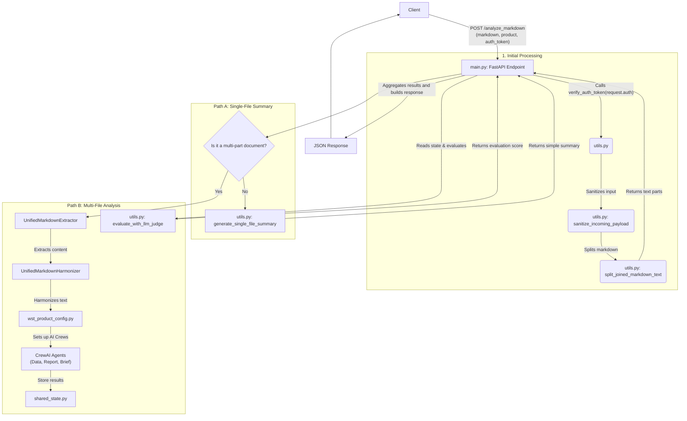

# Application Architecture Diagram

This diagram illustrates the complete workflow of the FastAPI application, from receiving a client request to sending the final response. It covers both the single-file summary path and the multi-file analysis path.

